# iPICS Django wagtail and Swagger API Documentation
By: Hachib Khan

## Abstract:
iPICS is the interactive Prostate cancer information, communication, and support program(iPICS), designed to improve communication, treatment-decision making, and quality of life for patients with newly diagnosed, localized prostate cancer and their families.


## Technical Overview: 

## Backend:
#### Folder Structure:
- Django-admin
    - Home
        - Migration
        > Migration is a way of applying changes that we have made to a model, into the database schema. Django creates a migration file inside the migration folder for each model to create the table schema, and each table is mapped to the model of which migration is created.
        - Static
        > Web applications generally need to serve additional files — such as images, JavaScript, or CSS — necessary to render the complete web page. In Django, we refer to these all files in Static folder.

        - Templates
        > Django provides a convenient way to generate dynamic HTML pages by using its template system. A template consists of static parts of the desired HTML output as well as some special syntax describing how dynamic content will be inserted. In HTML file, we can't write python code because the code is only interpreted by python interpreter not the browser. We know that HTML is a static markup language, while Python is a dynamic programming language. Django template engine is used to separate the design from the python code and allows us to build dynamic web pages.

        - ```__init__.py```
        > The ```__init__.py``` files are required to make Python treat the directories as containing packages; this is done to prevent directories with a common name, such as string, from unintentionally hiding valid modules that occur later on the module search path. The ```__init__```.py file indicates that the files in a folder are part of a Python package. Without an ```__init__.py``` file, you cannot import files from another directory in a Python project.

        - Models.py
        > A model is a class that represents table or collection in our DB, and where every attribute of the class is a field of the table or collection.

        - wagtail_hooks.py
        > Hooks are typically used to customise the view-level behaviour of the Wagtail admin and front-end. For customisations that only deal with model-level behaviour - such as calling an external service when a page or document is added - it is often better to use Django’s signal mechanism, as these are not dependent on a user taking a particular path through the admin interface.
    - iPics
        - Settings
            > The Django settings files are split up into base.py, dev.py, production.py and local.py.
            - ```base.py```
            > This file is for global settings that will be used in both development and production. Aim to keep most of your configuration in this file.

            - ```dev.py``` 
            > This file is for settings that will only be used by developers. For example: DEBUG = True

            - ```production.py```
            >  This file is for settings that will only run on a production server. For example: DEBUG = False

            ```local.py```
            > This file is used for settings local to a particular machine. This file should never be tracked by a version control system.

        - Templates
        - urls.py
        > A request in Django first comes to urls.py and then goes to the matching function in views.py. Python functions in views.py take the web request from urls.py and give the web response to templates. It may go to the data access layer in models.py as per the queryset.

        - ```wsgi.py```
        > WSGI refers to Web Server Gateway Interface. WSGI plays a important role at the time when you deploy your Django or Flask application. WSGI is a specification that describes the communication between web servers and Python web applications or frameworks. It explains how a web server communicates with python web applications/frameworks and how web applications/frameworks can be chained for processing a request

    - iPICSAPI
        - Migrations
        - Templates
        - Admin.py
        > The admin.py file is used to display your models in the Django admin panel. You can also customize your admin panel.
        - Apps.py
        > apps.py is just an alternate way to update your application related configuration and now when you create new app using below command
        ```python manage.py startapp ipicsAPI```you don't need to update the settings.INSTALLED_APPS

        - Models.py
        - Serializer.py
        > Serializers in Django REST Framework are responsible for converting objects into data types understandable by JavaScript and front-end frameworks. Serializers also provide de-serialization, allowing parsed data to be converted back into complex types, after first validating the incoming data.

        - Urls.py
        - views.py
        > A view is a place where we put our business logic of the application. The view is a python function which is used to perform some business logic and return a response to the user. This response can be the HTML contents of a Web page, or a redirect, or a 404 error.

    - Nginx
    > Nginx is an open source, fast, lightweight and high-performance web server that can be used to serve static files. NGINX is considered as the popular web server behind Apache web server and Microsoft's IIS. NGINX improves content and application delivery, improves security, and facilitates scalability and availability for the busiest websites on the internet.
    - Nginx Reverse Proxy
    > A proxy is a server that resides between internal applications and external clients, forwarding client requests to the appropriate server. An Nginx reverse proxy server is a proxy server that resides behind the firewall in a private network and directs client requests to the appropriate backend server. A reverse proxy gives an additional level of abstraction and control to ensure the smooth flow of network traffic between clients and servers.
  
    - Requirement.txt
    > Python requirements files are a great way to keep track of the Python modules. It is a simple text file that saves a list of the modules and packages required by your project. By creating a Python requirements.txt file, you save yourself the hassle of having to track down and install all of the required modules manually.
   

## Description
### Home 
Home is the main admin app. All the migration, models,templates and hooks are reside in this directory.
- Migration file of home app
- Extended templates of home app
- Home related models are here
- Hooks related to home app

### iPICS: 
This is our main project directory where all the main settings and urls reside.
- In the settings file we have all the configurations of the projects. 
- Extended templates of project base templates
- It is our main urls file where we include all the other apps urls

### iPICSAPI: 
- Migration file of ipicsAPI app
- It is used to register all model to admin
- Serializer is used to serialize data to json
- All the urls of api
- View class and methods resides in this files

### Nginx: 
All the configuration and certificate for nginx resides here.
### Smart_select: 
It a an independent app for cascading rows in admin panel
### Static: 
Projects all static files are in this directory
### Staticfiles: 
It is same as static but it is used when debug is false
### Requirement: 
All the dependency of this projects resides in this directory
### Docker-compose: 
It is used to build and run docker.

## Technical Tools: 
### Django Wagtail:

Wagtail is an open source content management system built on Django, with a strong community and commercial support. Wagtail is a Python based CMS made for Django. The Wagtail CMS was designed to be simple, ergonomic, and fast, and all of that was achieved by distributing responsibilities between the programmer and content manager. This distribution means that a content manager can’t create any new entity in the system using the admin panel interface without it being predefined in code. In other words, before using a page or a block of content in the admin panel, it must be created programmatically first.

### Install Guide:
- Install dependencies:
    - ``` pip3 install wagtail ```
- Create project:
    - ```wagtail start project_name ```
- Enter inside project:
    - ```cd project_name```
- Run Project:
    - ```python3 manage.py runserver```

## Django-ckeditor:
CKEditor is highly integrated into django CMS allowing the management of text, images and other custom content. We are using CKEditor because of the rich text field.

### Installation:
 - ```pip install django-ckeditor```

## Django rest framework:
Django REST framework (DRF) is a powerful and flexible toolkit for building Web APIs. Its main benefit is that it makes serialization much easier. Django REST framework is based on Django's class-based views, so it's an excellent option if you're familiar with Django.

### Installation:
- ```pip install djangorestframework```

## Whitenoise:
With a couple of lines of config WhiteNoise allows your web app to serve its own static files, making it a self-contained unit that can be deployed anywhere without relying on nginx, Amazon S3 or any other external service. WhiteNoise works with any WSGI-compatible app but has some special auto-configuration features for Django.

### Installation:
- ```pip install whitenoise```


## Admin Panel

## Login page:
After browsing this url(http://127.0.0.1:8000/admin/login/). We will login to the ipics admin panel. Here we need to provide user and password for login.

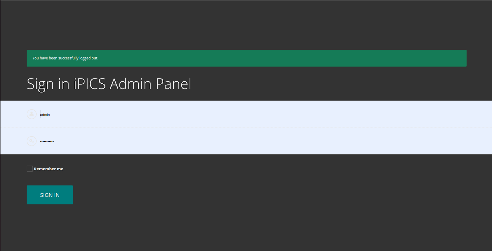

## Description:
Here we will see the admin panel home page. Menus are on the left side. Here We have three menus which are Textual Article, Audio Article, Video Article Admin. Login out button is on the bottom left corner of the page.

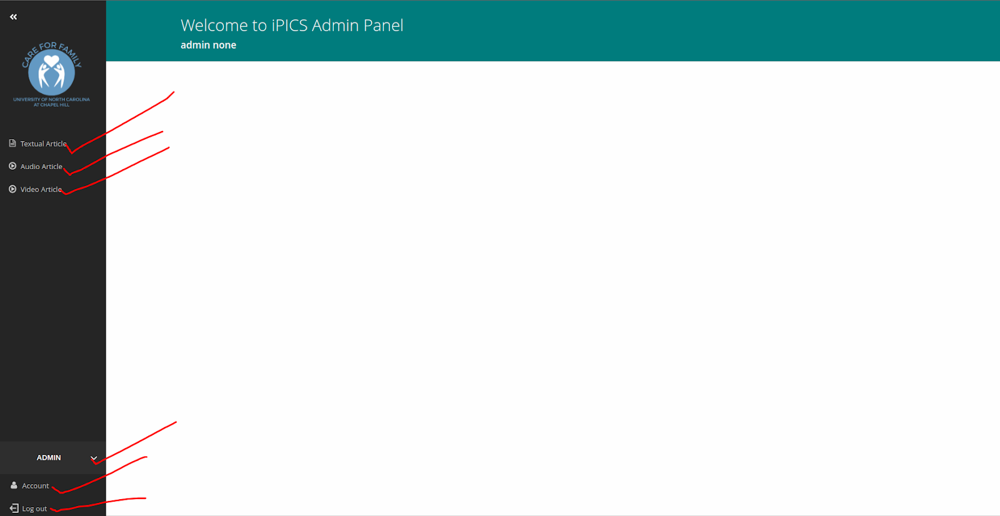


### Menu:
- Textual article
- Audio article
- Video article

## Textual article
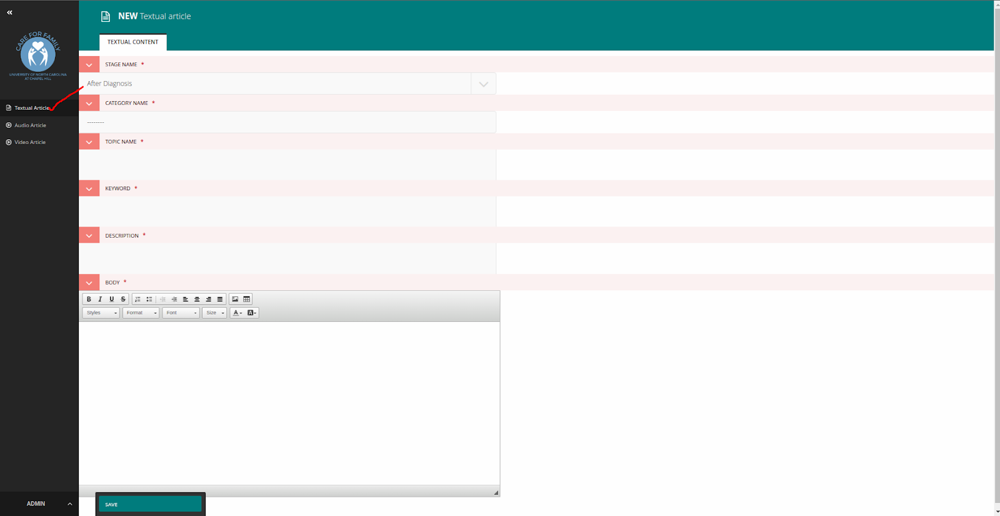
We can add, edit, delete articles using the textual article menu. 

## Audio article
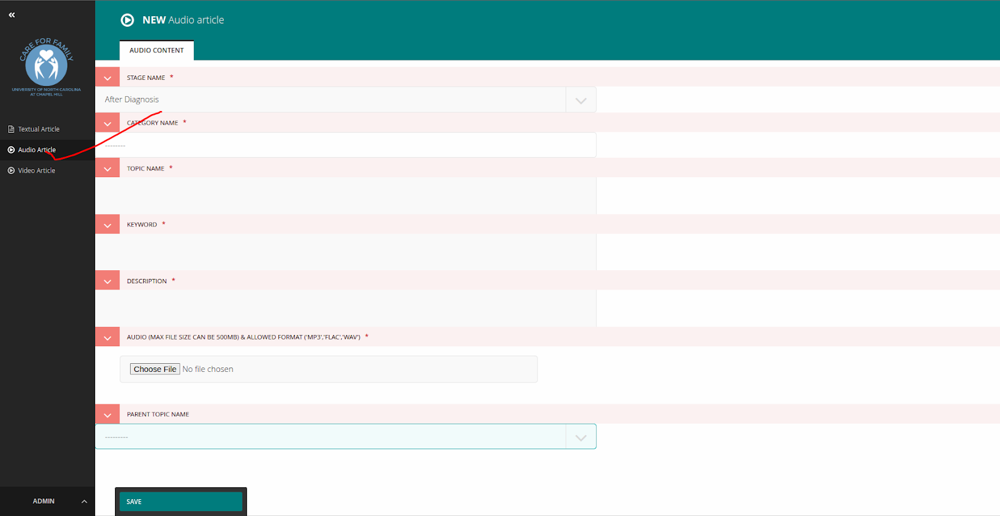
We can add, edit, delete articles using the audio article menu. 

## Video article

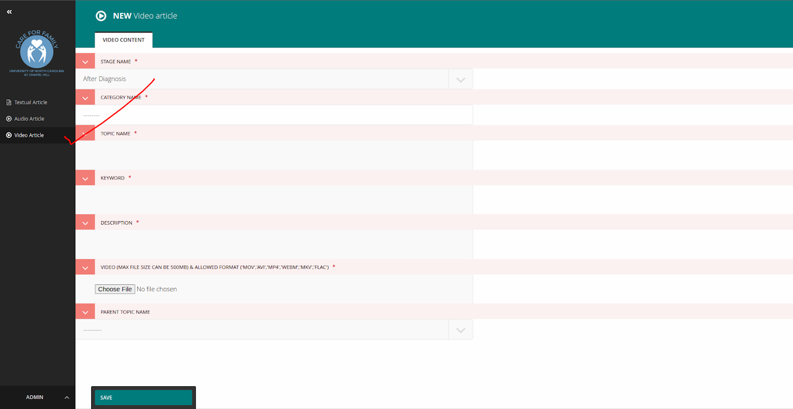

Can add, edit, delete articles using the video article menu.

### Account Page:
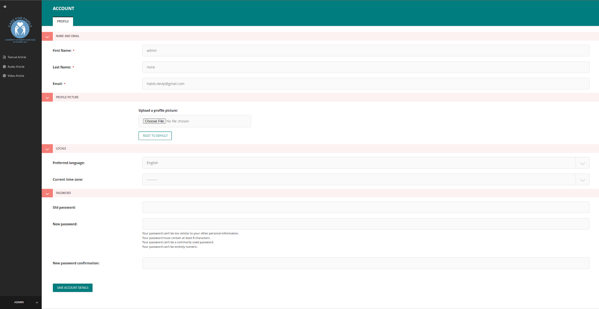

Logged in users can edit all information.

## iPICS Swagger API Documentation

### Abstract:
Swagger is an open source set of rules, specifications and tools for developing and describing RESTful APIs. The Swagger framework allows developers to create interactive, machine and human-readable API documentation.

# How to show swagger api
We need undo comment from url.py and from install apps

``` path('', schema_view.with_ui('swagger', cache_timeout=0), name='schema-swagger-ui')```

```'drf_yasg'```

## Accessing Swagger UI
Since we have enabled Swagger, let us see the documentation of our API endpoints done by Swagger. This is rendered through Swagger UI in the following link:

### http://127.0.0.1:8000/api/

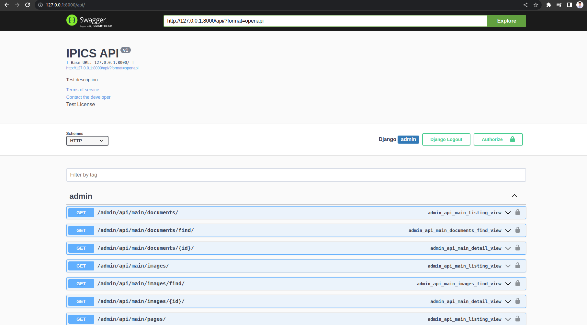

Swagger has put together the following information:-
Document metadata (API name, license, website, contact and so on)
All REST endpoints with default information it can infer from code. Note that endpoint descriptions are method names

# Documenting iPICS API
iPICS API End point picture
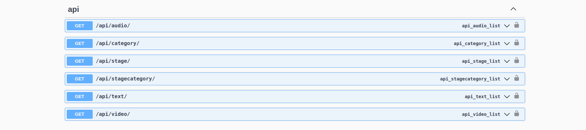

### Audio API end point
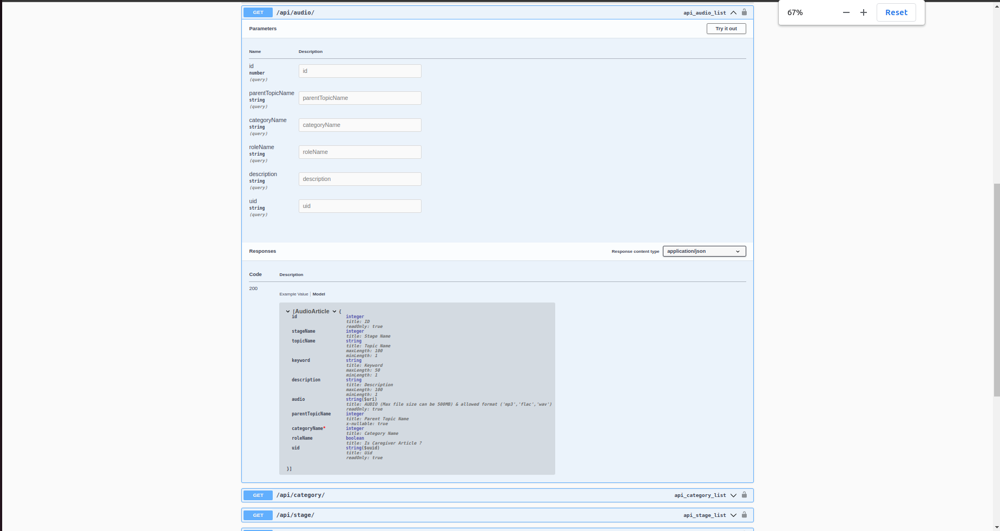
Anyone with access to this document can view the API endpoints and all other related metadata such as model structure, data types and so on.

### Category API end point
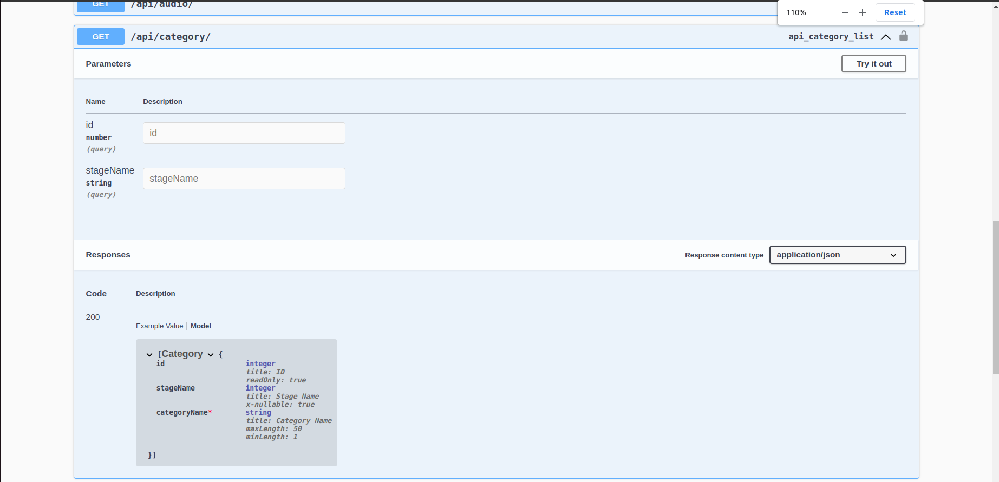

### Stage API end point
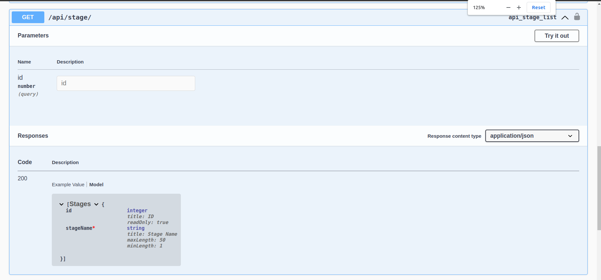

### Category Stage API end point
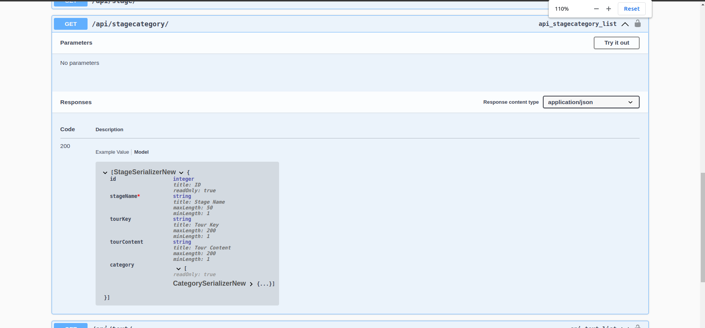

### Text API end point
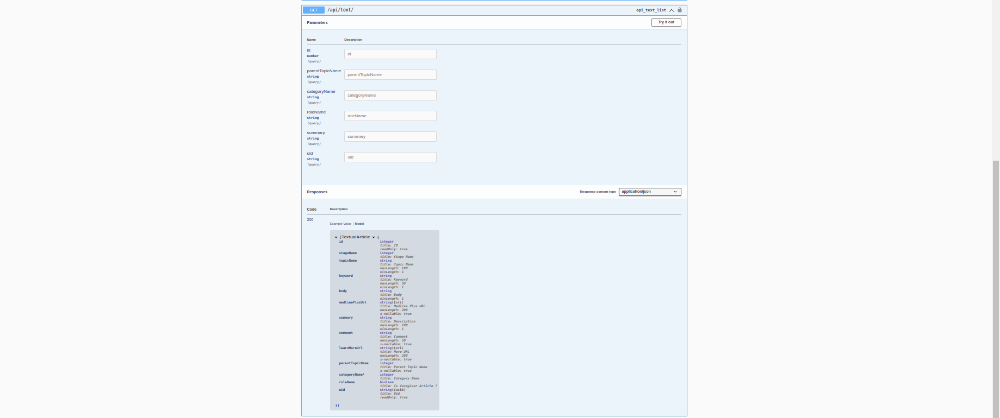

### Video API end point
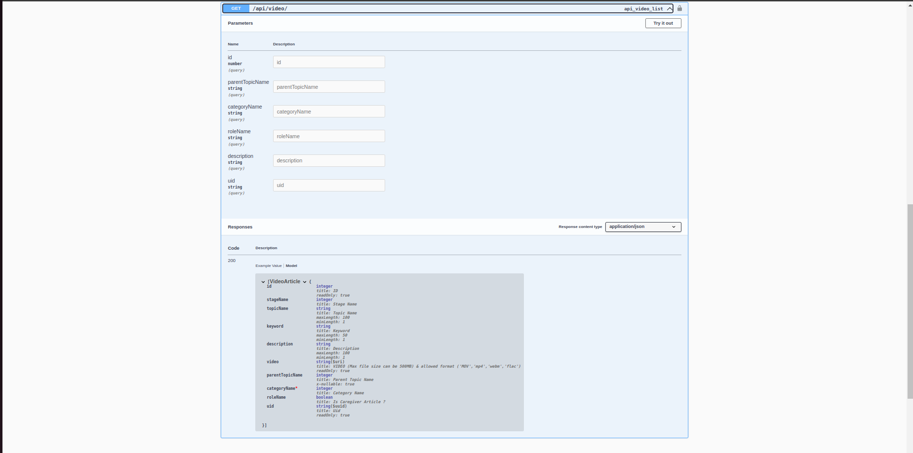

### Model 

